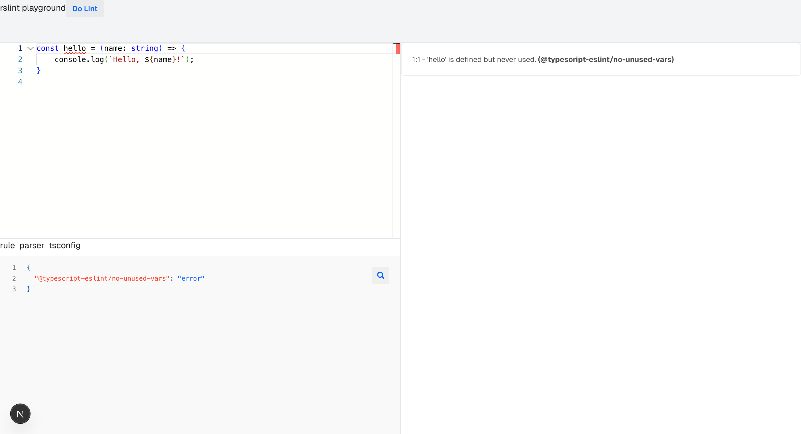

# Rslint Playground [Deprecated ⚠️]
> This project uses Next.js to implement server-side calls to the Rslint executable for detection and formatting. In the future, Rslint will implement a class interface, so this way of calling the executable will be deprecated.



## Deployment

```bash
nvm use
nrm use npm
npm install

npm run dev
```
